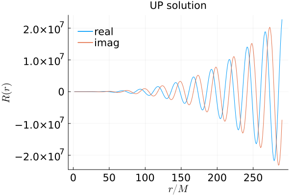
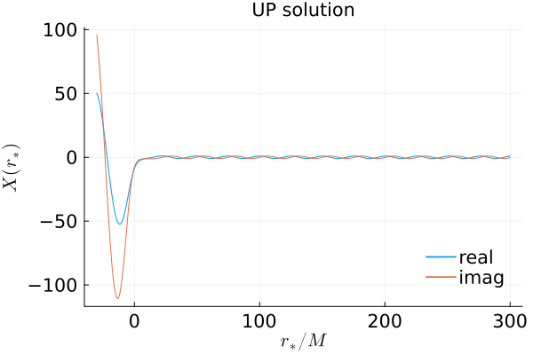
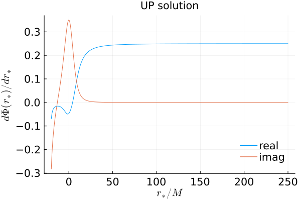
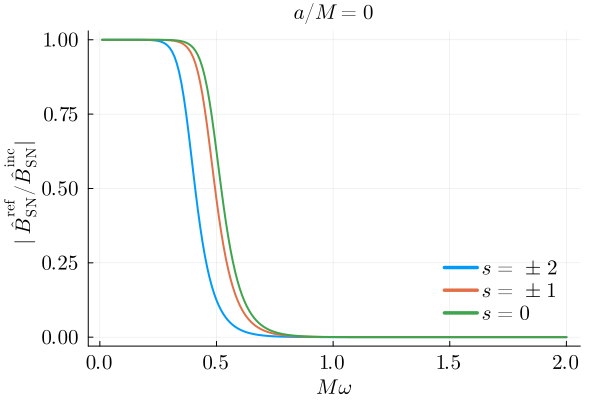
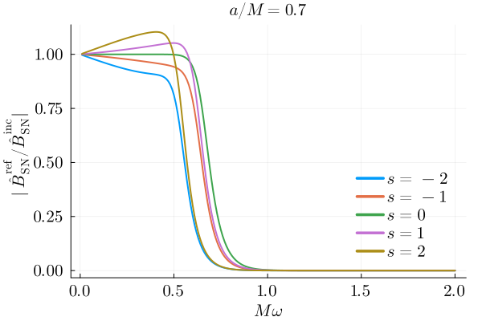

# Examples

```@contents
Pages = ["examples.md"]
```

## Example 1: Solving and visualizing some Teukolsky and GSN functions
In this example, we solve for the Teukolsky and the GSN function with
$s = -2, \ell = 2, m = 2, a = 0.7, \omega = 0.25$ that satisfy the purely outgoing condition
at infinity (i.e. `UP`).
```julia
using GeneralizedSasakiNakamura
using Plots, LaTeXStrings

# Specify which mode and what boundary condition
s=-2; l=2; m=2; a=0.7; omega=0.25; bc=UP; # Change to bc=IN to solve for R^in or X^in instead
# Specify where to match to ansatzes
rsin=-20; rsout=250;

# NOTE: julia uses 'just-ahead-of-time' compilation. Calling this the first time in each session will take some time
R = Teukolsky_radial(s, l, m, a, omega, bc, rsin, rsout);

# Set up a grid of the tortoise coordinate rs
rsgrid = collect(-30:1:300); # Does not have to be within [rsin, rsout]
# Set up a grid of the Boyer-Lindquist r coordinate
# Convert from rsgrid using r_from_rstar(a, rs)
rgrid = [r_from_rstar(a, rs) for rs in rsgrid];
```

```julia
# Visualize the Teukolsky function

# Use the 'shortcut' interface to access the function
plot(rgrid, [real(R(r)) for r in rgrid], label="real")
# Use the full interface to access the function (and its derivative)
plot!(rgrid, [imag(R.Teukolsky_solution(r)[1]) for r in rgrid], label="imag")
plot!(
    legendfontsize=14,
    xguidefontsize=14,
    yguidefontsize=14,
    xtickfontsize=14,
    ytickfontsize=14,
    foreground_color_legend=nothing,
    background_color_legend=nothing,
    legend=:topleft,
    xlabel=L"r/M",
    ylabel=L"R(r)",
)
title!("$(R.boundary_condition) solution")
```

```julia
# Visualize the underlying GSN function

# Use the 'shortcut' interface to access the function
plot(rsgrid, [real(R.GSN_solution(rs)) for rs in rsgrid], label="real")
# Use the full interface to access the function (and its derivative)
plot!(rsgrid, [imag(R.GSN_solution.GSN_solution(rs)[1]) for rs in rsgrid], label="imag")
plot!(
    legendfontsize=14,
    xguidefontsize=14,
    yguidefontsize=14,
    xtickfontsize=14,
    ytickfontsize=14,
    foreground_color_legend=nothing,
    background_color_legend=nothing,
    legend=:bottomright,
    xlabel=L"r_{*}/M",
    ylabel=L"X(r_{*})",
)
title!("$(R.boundary_condition) solution")
```

```julia
# Visualize the underlying complex frequency function
# NOTE: for this one, rstar has to be within [rsin, rsout]
plot(collect(rsin:0.1:rsout), [real(R.GSN_solution.numerical_Riccati_solution(rs)[2]) for rs in rsin:0.1:rsout], label="real")
# Use the full interface to access the function (and its derivative)
plot!(collect(rsin:0.1:rsout), [imag(R.GSN_solution.numerical_Riccati_solution(rs)[2]) for rs in rsin:0.1:rsout], label="imag")
plot!(
    legendfontsize=14,
    xguidefontsize=14,
    yguidefontsize=14,
    xtickfontsize=14,
    ytickfontsize=14,
    foreground_color_legend=nothing,
    background_color_legend=nothing,
    legend=:bottomright,
    xlabel=L"r_{*}/M",
    ylabel=L"d\Phi(r_{*})/dr_{*}",
)
title!("$(R.boundary_condition) solution")
```


## Example 2: Plotting reflectivity of black holes (in GSN formalism)
```julia
using GeneralizedSasakiNakamura
using Plots, LaTeXStrings

sarr = [-2, -1, 0, 1, 2];
l=2;m=2;a=0.0;
reflectivity_from_inf_nonrotating = Dict()
omegas = collect(0.01:0.01:2.0);

for s in sarr
    reflectivity_from_inf_nonrotating[s] = []
    for omg in omegas
        Xin = GSN_radial(s, l, m, a, omg, IN, -20, 250)
        append!(reflectivity_from_inf_nonrotating[s], Xin.reflection_amplitude/Xin.incidence_amplitude)
    end
end
```
```julia
plot(omegas, abs.(reflectivity_from_inf_nonrotating[-2]), linewidth=2, color=theme_palette(:auto)[1], label=L"s = \pm 2")
plot!(omegas, abs.(reflectivity_from_inf_nonrotating[-1]), linewidth=2, color=theme_palette(:auto)[2], label=L"s = \pm 1")
plot!(omegas, abs.(reflectivity_from_inf_nonrotating[0]), linewidth=2, color=theme_palette(:auto)[3], label=L"s = 0")
plot!(
    legendfontsize=14,
    xguidefontsize=14,
    yguidefontsize=14,
    xtickfontsize=14,
    ytickfontsize=14,
    foreground_color_legend=nothing,
    background_color_legend=nothing,
    legend=:bottomright,
    formatter=:latex,
    xlabel=L"M\omega",
    ylabel=L"| \hat{B}^{\mathrm{ref}}_{\mathrm{SN}}/\hat{B}^{\mathrm{inc}}_{\mathrm{SN}} |",
    left_margin = 2Plots.mm,
    right_margin = 3Plots.mm,
)
title!(L"a/M = 0")
```

```julia
sarr = [-2, -1, 0, 1, 2];
l=2;m=2;a=0.7;
reflectivity_from_inf_rotating = Dict()
omegas = collect(0.01:0.01:2.0);

for s in sarr
    reflectivity_from_inf_rotating[s] = []
    for omg in omegas
        Xin = GSN_radial(s, l, m, a, omg, IN, -20, 250)
        append!(reflectivity_from_inf_rotating[s], Xin.reflection_amplitude/Xin.incidence_amplitude)
    end
end
```
```julia
plot(omegas, abs.(reflectivity_from_inf_rotating[-2]), linewidth=2, color=theme_palette(:auto)[1], label=L"s = -2")
plot!(omegas, abs.(reflectivity_from_inf_rotating[-1]), linewidth=2, color=theme_palette(:auto)[2], label=L"s = -1")
plot!(omegas, abs.(reflectivity_from_inf_rotating[0]), linewidth=2, color=theme_palette(:auto)[3], label=L"s = 0")
plot!(omegas, abs.(reflectivity_from_inf_rotating[1]), linewidth=2, color=theme_palette(:auto)[4], label=L"s = 1")
plot!(omegas, abs.(reflectivity_from_inf_rotating[2]), linewidth=2, color=theme_palette(:auto)[5], label=L"s = 2")
plot!(
    legendfontsize=14,
    xguidefontsize=14,
    yguidefontsize=14,
    xtickfontsize=14,
    ytickfontsize=14,
    foreground_color_legend=nothing,
    background_color_legend=nothing,
    legend=:bottomright,
    formatter=:latex,
    xlabel=L"M\omega",
    ylabel=L"| \hat{B}^{\mathrm{ref}}_{\mathrm{SN}}/\hat{B}^{\mathrm{inc}}_{\mathrm{SN}} |",
    left_margin = 2Plots.mm,
    right_margin = 3Plots.mm,
)
title!(L"a/M = 0.7")
```
